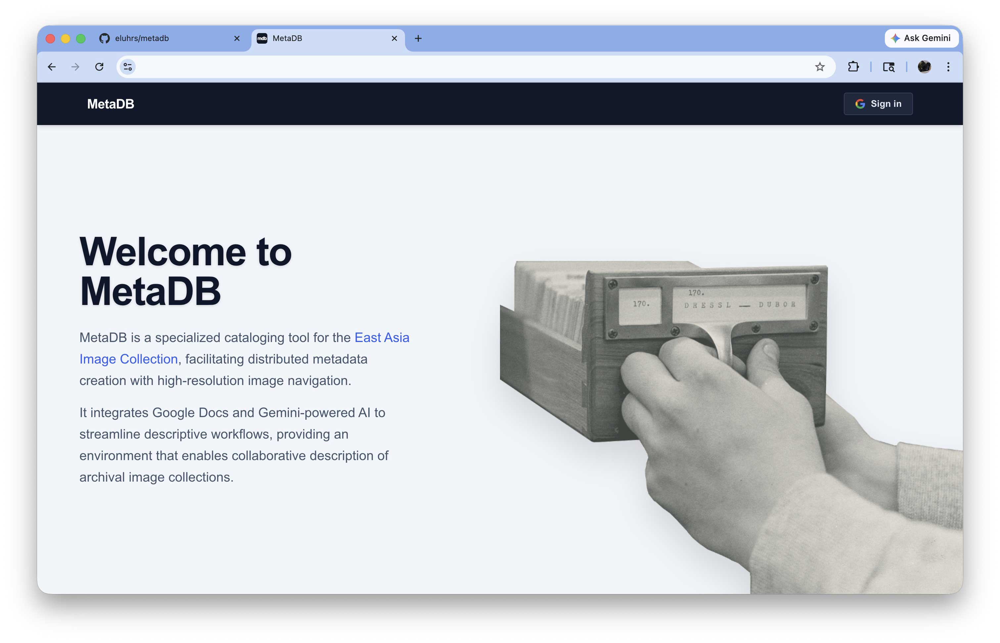
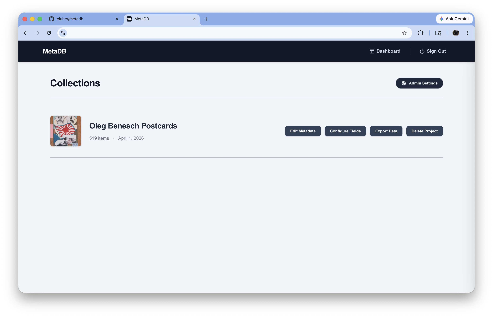
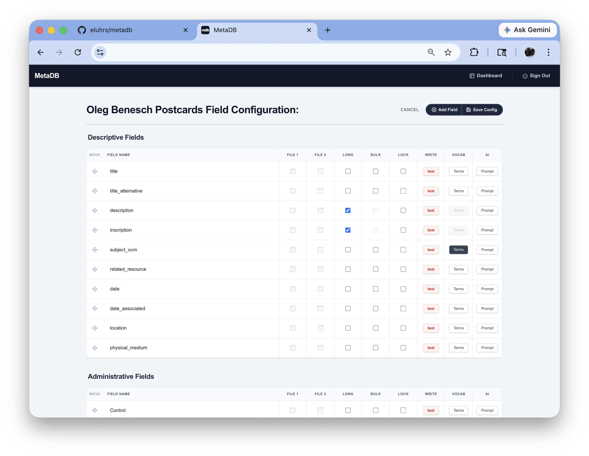
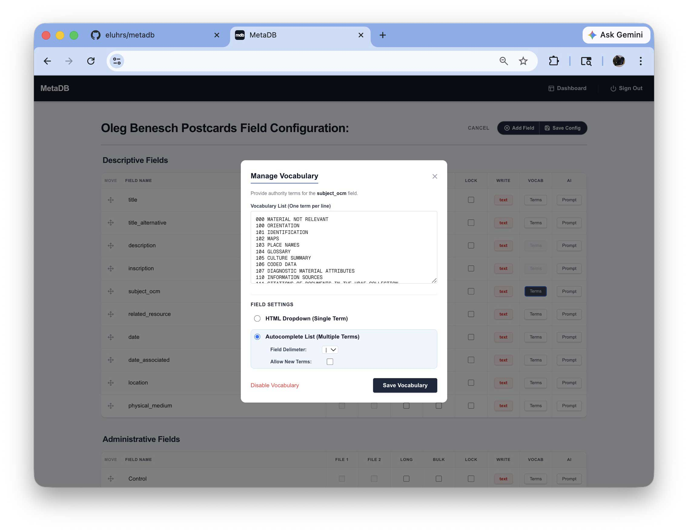
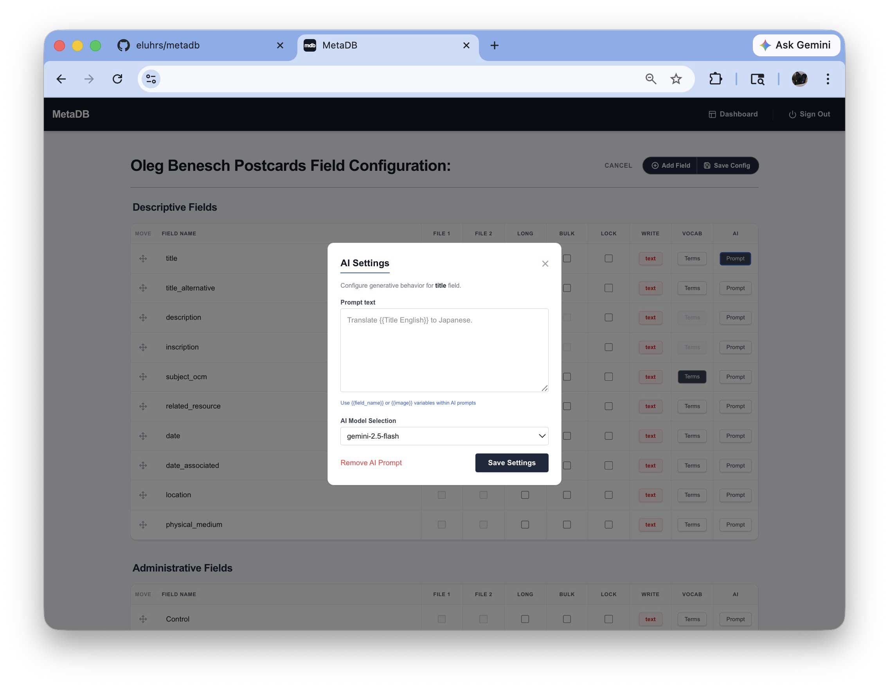
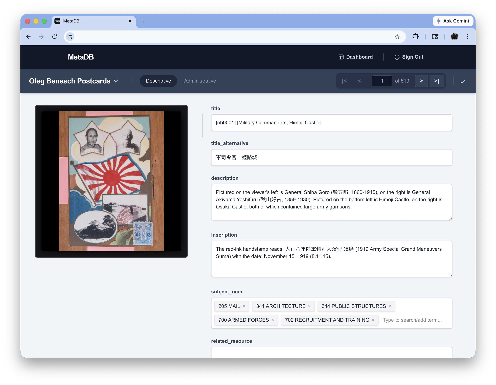
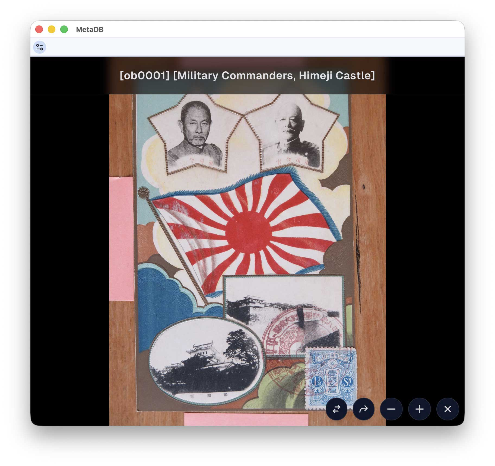

# MetaDB

A cataloging application for archivists and librarians to map, edit, and organize metadata around high-resolution historical documents and images stored on Google Drive. Built with Next.js, PostgreSQL, and Google integration.

## Overview

MetaDB is a specialized cataloging tool designed for distributed metadata creation with high-resolution image navigation. It integrates Google Drive for image storage, Google Sheets for catalog data, and Gemini-powered AI to streamline descriptive workflows — providing an environment that enables collaborative description of archival image collections.

Administrators use Google Drive access to import collections — including metadata spreadsheet templates and image files — which are then cached locally in the application's database and tile cache. Once a collection is imported, regular users only need basic Google OAuth sign-in to access the interface; they do not require any Google Drive permissions. Administrators can configure and reorder metadata fields, define controlled vocabularies, and set up per-field AI prompts. Depending on how fields are configured, users can bulk-update values across items, trigger Gemini-powered AI actions, and select from controlled vocabulary terms. High-resolution images are displayed through an OpenSeadragon deep-zoom viewer.

MetaDB is designed to fit into existing archival workflows. Collections are imported using metadata spreadsheets from Google Drive that follow an institution's existing schema, preserving the original field structure and terminology. Once cataloging is complete, the finished metadata can be exported in the same spreadsheet format, ready for ingest into a digital repository or asset management system without additional transformation.

## Screenshots

<!-- Add screenshots to a screenshots/ directory and update the paths below. -->

### Landing Page

<a href="screenshots/login.jpg"></a>

*Welcome page with Google Sign-In and a description of the application.*

---

### Collections Dashboard

<a href="screenshots/dashboard.jpg"></a>

*The main dashboard listing archival collections with thumbnail previews, item counts, and quick actions for editing metadata, configuring fields, exporting data, or deleting projects.*

---

### Field Configuration

<a href="screenshots/edit-fields.jpg"></a>

*Field configuration interface with drag-and-drop reordering. Each field can be toggled for file mapping, long text, bulk editing, locking, write mode, controlled vocabulary, and AI prompt configuration.*

---

### Controlled Vocabulary

<a href="screenshots/edit-fields-authority.jpg"></a>

*Vocabulary management dialog for defining authority terms on a field. Supports single-value dropdowns or multi-value autocomplete with configurable delimiters and the optional ability to add new terms to the control list.*

---

### AI Prompt Configuration

<a href="screenshots/edit-fields-ai.jpg"></a>

*Per-field AI settings dialog for configuring Gemini-powered metadata generation. Prompts can reference the image or other field values using template variables.*

---

### Metadata Editor

<a href="screenshots/edit-metadata.jpg"></a>

*Item-level metadata editing view showing the image alongside editable descriptive fields. Navigate between items in the collection with pagination controls. Fields with controlled vocabularies display autocomplete tag inputs.*

---

### Image Viewer

<a href="screenshots/popout.jpg"></a>

*OpenSeadragon deep-zoom pop-out viewer for examining high-resolution scans with flip, rotate, zoom in, and zoom out controls.*

---

## Architecture

| Component | Technology |
|---|---|
| **Framework** | Next.js 14 (App Router) |
| **Database** | PostgreSQL, managed with Prisma ORM |
| **Styling** | Tailwind CSS |
| **Image Viewer** | OpenSeadragon (deep-zoom WebGL engine) |
| **Drag & Drop** | @dnd-kit |
| **Authentication** | NextAuth with Google OAuth |
| **AI Features** | Google Gemini API |
| **Infrastructure** | Docker Compose |

### Google Integration

Administrators import collections into MetaDB from Google Drive, which includes metadata spreadsheet templates and high-resolution image files. During import, images are cached locally as deep-zoom tiles and metadata is stored in the PostgreSQL database. After import, regular users only need basic Google OAuth sign-in to authenticate — no Drive or Sheets permissions are required for day-to-day cataloging.

- **Google Drive** — Used by administrators to import collection images and metadata templates. Images are streamed through an internal Next.js proxy during import and cached locally as tiles for the deep-zoom viewer.
- **Google Sheets** — Source format for metadata templates that define a collection's initial field structure and data.
- **Google Gemini** — Powers per-field AI-assisted metadata generation with configurable prompts and model selection.

## Prerequisites

- **Docker** and **Docker Compose**
- **Node.js 20+** (for local development)
- **Google Cloud project** with the following APIs enabled:
  - Google Drive API
  - Google Sheets API
  - Generative Language API (Gemini)
- **Google OAuth credentials** (Client ID and Client Secret)
- **Google Service Account** (optional, for background image access)

## Installation & Setup

### Production (Docker)

1. **Clone the repository:**

   ```bash
   git clone https://github.com/eluhrs/metadb.git
   cd metadb
   ```

2. **Configure environment variables:**

   Create a `.env` file with the following:

   ```dotenv
   # Database
   POSTGRES_PASSWORD=your_secure_password

   # NextAuth
   NEXTAUTH_URL=http://localhost:3000
   NEXTAUTH_SECRET=your_generated_secret

   # Google OAuth
   GOOGLE_CLIENT_ID=your_client_id
   GOOGLE_CLIENT_SECRET=your_client_secret

   # Google Gemini
   GEMINI_API_KEY=your_gemini_key
   GEMINI_MODELS=gemini-2.0-flash

   # Admin
   ADMIN_EMAIL=your_admin@email.com

   # Google Service Account (optional)
   GOOGLE_SERVICE_ACCOUNT_CREDENTIALS={"type":"service_account",...}
   ```

3. **Start the application:**

   ```bash
   docker compose -f docker-compose.prod.yml up -d --build
   ```

4. **Open** `http://localhost:3000` in your browser.

### Development

1. **Start the development database:**

   ```bash
   npm run dev:db:start
   ```

2. **Push the Prisma schema:**

   ```bash
   npm run dev:db:push
   ```

3. **Install dependencies and start the dev server:**

   ```bash
   npm install
   npm run dev
   ```

4. **Open** `http://localhost:3000`.

To reset the development database completely:

```bash
npm run dev:reset
```

## Testing

MetaDB uses Playwright for end-to-end testing:

```bash
npx playwright test
```

Test results and reports are saved to the `test-results/` and `playwright-report/` directories.

## User Roles

Access is controlled through role-based permissions:

- **LIBRARIAN** — Full admin access including user management, configuration, and all cataloging features.
- **Standard users** — Cataloging and metadata editing within assigned projects.

Admin privileges are enforced server-side via Prisma role checks.

## License

*License information to be added.*
